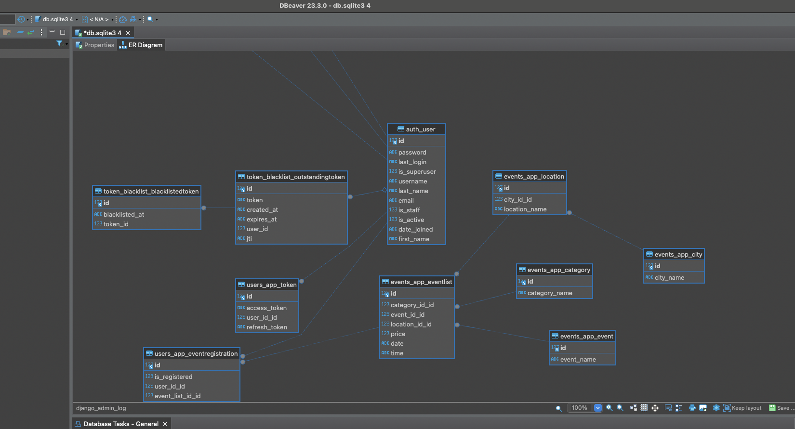

# Events API 

<p align="center">
  
  
  
  
  
  
  
</p>

## О проекте
Веб-приложение, которое имеет следующие задачи:
- хранение информации обо всех событиях и мероприятиях, проходящих на территории РФ
- регистрация людей на мероприятия
- отмена регистраций на мепроприятия
- формирование аналитики по мероприятиям и посетителям

## Схема БД
<p align="center">
  
</p>

## Ключевые особенности
- взаимодействие с серверной частью приложения происходит через API
- реализована спецификация OpenAPi с помощью библиотеки drf-yasg
- аутентификация и авторизация пользователей производится с помощью JWT-токенов
- взаимодействие с API возможно только для зарегистрированных пользователей

## Функционал пользователя
- получить список всех мероприятий или одного из них
- получить список всех мероприятий или одного из них по датам и времени
- зарегистрироваться на выбранное мероприятие
- отменить регистрацию на мероприятие
- просмотреть все мероприятия, на которые есть регистрация
- пользователь может просмотреть только "свои" регистрации, но не чужих пользователей
- пользователь может отменить только "свои" регистрации, но не чужих пользователей
- пользователь может зарегистрировать только самого себя, но не других пользователей

## Как взаимодействовать с приложением
Работать с API можно через Postman или Swagger по ссылке http://127.0.0.1:8000/swagger/

## Установка:

- склонировать данный репозиторий
- перейти в каталог с проектом
- командой python manage.py migrate сделать миграции
- командой python manage.py runserver запустить работу приложения
- командой python manage.py createsuperuser создать суперпользователя
- заполнить поочередно данные суперпользователя

## Добавление информации в базу данных
- по эндпойнтам /v1/login/ или /api/token/ получить aceess и refresh токены, отправив post-запрос с данными администратора
  ```javascript
  { "username": "имя администратора" ,
    "password": "пароль"}
  ```
- перед дальнейшими запросами установить следующий заголовок с access токеном, полученном из предыдущего запроса в следующем формате. Без данного заголовка работа API невозможна
  ```javascript
  { "Authorization": "Bearer access_token" }
  ```
- по эндпойнту /v1/cities/ отправить post-запрос с содержанием ниже. Добавить город в БД
  ```javascript
  { "city_name": "Москва" }
  ```
- по эндпойнту /v1/categories/ отправить post-запрос с содержанием ниже. Добавить категорию в БД
  ```javascript
  { "category_name": "Мюзикл" }
  ```
- по эндпойнту /v1/locations/ отправить post-запрос с содержанием ниже. Добавить локацию в БД. В случае, если город в БД не существует, то будет создан новый
  ```javascript
  {
  "city_id": {
    "city_name": "Москва"
  },
  "location_name": "МДМ"
  }
  ```
- по эндпойнту /v1/events/ отправить post-запрос с содержанием ниже. Добавить событие в БД.
  ```javascript
  {
  "event_name": "Поющие под дождем"
  }
  ```
- по эндпойнту /v1/events-list/ отправить post-запрос с содержанием ниже. Добавить событие с конкретным временем в БД. В случае, если объекты в запросе не существуют, то они будут созданы заново
  ```javascript
  {
  "event_id": {
    "event_name": "Москва"
  },
  "category_id": {
    "category_name": "Мюзикл"
  },
  "location_id": {
    "city_id": {
      "city_name": "Москва"
    },
    "location_name": "МДМ"
  },
  "date": "2024-04-18",
  "time": "string",
  "price": 0
  ```
}


## Регистрация на мероприятие
- по эндпойнту /v1/register/ отправить post-запрос с содержаниме ниже. Создать нового пользователя
  ```javascript
  {
  'username': 'имя пользователя',
  'first_name': 'имя',
  'last_name': 'фамилия',
  'email': 'почта',
  'password': 'пароль',
  }
  ```
- по эндпойнтам /v1/login/ или /api/token/ получить aceess и refresh токены, отправив post-запрос с данными пользователя
  ```javascript
  { "username": "имя пользователя",
    "password": "пароль"}
  
- установить заголовок как в случае с администратором
  ```javascript
  { "Authorization": "Bearer access_token" }
  ```
- по эндпойнтам /v1/events-list/ или /v1/events-list/{pk:} получить список мероприятий или одно мероприятие. Выбрать необходимое
- по эндпойнту /v1/events-registration/ отправить post-запрос с содержаниме ниже. Зарегистрироваться на мероприятие. 
  ```javascript
  {
    "event_list_id": {
        "event_id": {
             "event_name": "Поющие под дождем"
         },
         "category_id": {
             "category_name": "Мюзикл"
         },
         "location_id": {
             "city_id": {
                 "city_name": "Москва"
             },
             "location_name": "МДМ"
         },
         "date": "2024-04-16",
         "time": "15:00:00",
         "price": 2000
    },
    "user_id": {
        "first_name": "имя пользователя",
        "last_name": "фамилия пользователя",
        "email": "почта"
    },
    "is_registered": "True"
  }
  ```
- по эндпойнту /v1/events-registration/ отправить get-запрос и получить все мероприятия, на которые есть регистрация
- для отмены записи нужно по эндпойнту /v1/events-registration/{pk:} отправить delete-запрос. Ключ pk можно получить из предыдущего запроса.
- для выхода из системы по эндпойнту /v1/logout/ отправить post-запрос с заголовком ниже.
  ```javascript
  {
  "refresh_token": "refresh токен пользователя"
  }
  ```

## Тесты
Для запуска тестирования необходимо:
- перейти в главный каталог с файлом manage.py
- запустить команду python manage.py test users_app.tests
- запустить команду python manage.py test events_app.tests
